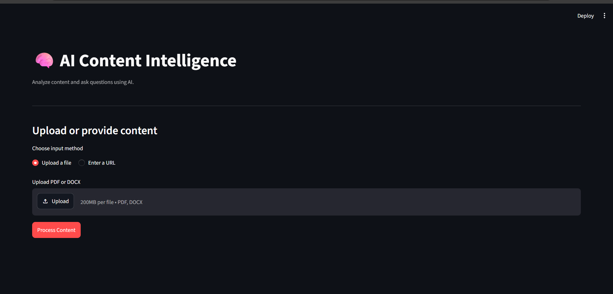
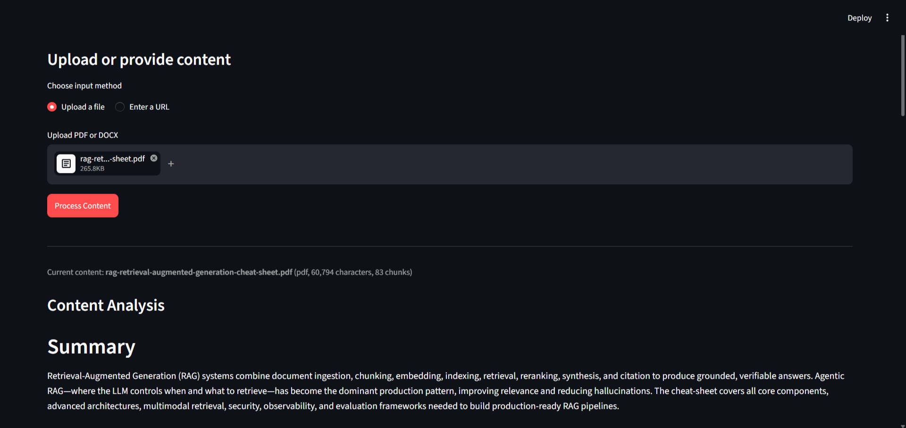
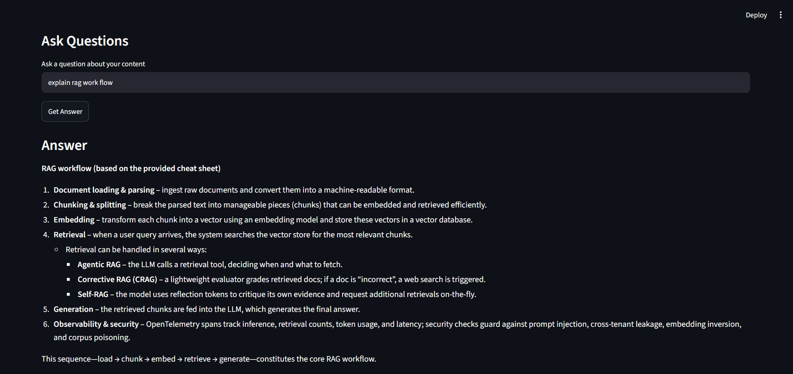

# Multisource AI Content Intelligence

An LLM-powered application that analyzes PDFs, DOCX files, websites, and YouTube videos. It generates structured content insights and answers questions using Retrieval-Augmented Generation (RAG).

## Features

* **Multi-source ingestion:** Process PDF, DOCX, website URLs, and YouTube videos through a unified pipeline.
* **Content analysis:** Generate summaries, key points, main topics, important concepts, and insights.
* **RAG question answering:** Answer questions using retrieved content and provide source references.
* **Document isolation:** Use a separate in-memory Chroma vector store for each processed document.
* **Document-level questions:** Answer overview questions using the analysis of the entire document.
* **Long-document support:** Analyze large text inputs through a hierarchical batch-and-merge workflow, subject to a configurable size limit.
* **YouTube transcription fallback:** Use Whisper transcription when a usable video transcript is unavailable.
* **Streamlit interface:** View analysis, ask questions, track processing progress, and receive user-friendly error messages.

## Screenshots

### Application Interface


### Content Analysis


### Question Answering with Sources

 
## Architecture

```text
PDF / DOCX / Website / YouTube
              |
        Unified Loader
              |
     Clean and Validate Text
              |
       +------+------+
       |             |
  Text Chunking   Text Batching
       |             |
   Embeddings     Batch Analysis
       |             |
 In-memory Chroma  Merge Notes
       |             |
   Retriever      Final Report
       |             |
       +------+------+
              |
       Question Routing
              |
       +------+------+
       |             |
 Document-level   Specific
   Questions      Questions
       |             |
 Full Analysis   Retrieved Chunks
       |             |
       +------+------+
              |
         LLM Answer
              |
       Streamlit UI
```

The application uses a unified processing pipeline in `src/pipeline.py`. Each processed source is represented by a `ProcessedContent` object containing its chunks, vector store, retriever, and generated analysis. The Streamlit app manages the current document and releases its vector store when replacing it.

## Tech Stack

| Component           | Technology                                 |
| ------------------- | ------------------------------------------ |
| Language            | Python                                     |
| User interface      | Streamlit                                  |
| LLM                 | Groq API                                   |
| LLM integration     | LangChain                                  |
| Embeddings          | Sentence Transformers — `all-MiniLM-L6-v2` |
| Vector database     | Chroma                                     |
| Document processing | pypdf, python-docx                         |
| Website extraction  | BeautifulSoup, LangChain WebBaseLoader     |
| YouTube transcripts | youtube-transcript-api                     |
| Audio transcription | yt-dlp, faster-whisper                     |

## Project Structure

```text
app/
└── main.py

src/
├── config.py
├── exception.py
├── llm_service.py
├── pipeline.py
├── embeddings/
├── ingestion/
├── intelligence/
├── processing/
├── rag/
└── retrieval/

screenshots/
.env.example
.gitignore
README.md
requirements.txt
```

### Main Modules

* `app/main.py` — Streamlit user interface.
* `src/pipeline.py` — Coordinates content processing and resource cleanup.
* `src/ingestion/` — Loads PDF, DOCX, website, and YouTube content.
* `src/processing/text_processor.py` — Cleans text and creates chunks.
* `src/embeddings/` — Initializes the embedding model.
* `src/retrieval/` — Creates isolated vector stores and retrievers.
* `src/rag/qa_chain.py` — Routes questions and generates context-based answers.
* `src/intelligence/content_analyzer.py` — Generates structured analysis using batched LLM calls.
* `src/config.py` — Stores application settings and configurable limits.
* `src/exception.py` — Defines application-specific exceptions.

## Getting Started

### Prerequisites

* Python compatible with the installed dependencies.
* A Groq API key.
* Git, if cloning the repository.

### 1. Clone the repository

```bash
git clone https://github.com/Mahi3207/multisource-ai-content-intelligence.git
cd multisource-ai-content-intelligence
```

### 2. Create a Conda environment

```bash
conda create -n ai-content-intel python=3.11 -y
conda activate ai-content-intel
```

### 3. Install dependencies

```bash
python -m pip install -r requirements.txt
```

### 4. Configure environment variables

Create a local `.env` file from the example:

**Windows PowerShell**

```powershell
Copy-Item .env.example .env
```

Open `.env` and add your own API key:

```env
GROQ_API_KEY=your_groq_api_key
```

Review `.env.example` for optional configuration settings.

**Never commit your `.env` file or expose your API key.**

### 5. Run the application

```bash
streamlit run app/main.py
```

Open the local URL displayed in the terminal by Streamlit.

## How It Works

### 1. Content Ingestion

The application detects the source type and loads the content using the corresponding loader. Extracted text is cleaned while preserving useful paragraph breaks and metadata.

### 2. Chunking and Embeddings

The text is split into overlapping chunks. Each chunk retains relevant metadata, such as the source, page or timestamp, chunk ID, and document ID. An embedding model converts the chunks into vectors for semantic retrieval.

### 3. Isolated Vector Storage

Each processed document receives a unique, in-memory Chroma collection. The retriever filters results by document ID, preventing chunks from a previous document from being mixed into the current document's results.

The index is temporary and is rebuilt when the content is processed again.

### 4. Question Answering with RAG

For specific questions, the retriever finds relevant chunks and supplies them to the LLM as context. The prompt instructs the model to answer only from that context and avoid inventing unsupported information. Retrieved sources are displayed alongside the answer.

If no chunks are retrieved, the application returns its configured fallback response without calling the LLM.

### 5. Document-Level Questions

Questions about the overall topic, summary, or key points can be routed to the analysis of the entire document instead of relying only on a few retrieved chunks. This routing uses predefined text patterns, so unusual phrasings may not always be recognized as document-level questions.

## Long-Document Analysis

Long inputs are analyzed in stages rather than being sent as one large prompt:

1. **Batch:** Split the text into manageable sections.
2. **Map:** Generate notes for each section.
3. **Reduce:** Merge the notes in multiple rounds when needed.
4. **Final report:** Generate the structured analysis with five sections: Summary, Key Points, Main Topics, Important Concepts, and Insights.

The application checks the configured text-size limit before embedding and analysis. Inputs that exceed the limit are rejected rather than silently treated as fully analyzed. LLM requests are retried when they fail, and persistent errors are reported to the user.

## YouTube Transcription

The application first attempts to retrieve an available YouTube transcript. If that fails, it can download the video's audio and use faster-whisper for local transcription.

Transcribed text follows the same processing pipeline as other sources. Timestamp metadata helps identify where content originated in the video.

Whisper may download its model on first use, and CPU transcription can take time for longer videos. YouTube access restrictions may also prevent transcript or audio retrieval.

## Limitations

* Processes one document at a time.
* Scanned PDFs without extractable text are not supported because OCR is not implemented.
* Websites requiring authentication or JavaScript rendering may not load correctly.
* Very large inputs may be rejected by the configured size limit.
* Document-level question routing relies on predefined patterns.
* Results depend on the quality of the source content and LLM response.
* Whisper transcription can be slow on a CPU.
* In-memory vector stores do not persist across application restarts.
* Groq API rate limits can temporarily interrupt analysis or question answering.

## Future Improvements

* OCR support for scanned PDFs.
* Support for multiple documents and document selection.
* More flexible question routing.
* Downloadable analysis reports.
* Streaming responses and optional GPU acceleration for transcription.

## License

Add a license if you intend to distribute this project under specific reuse terms.
